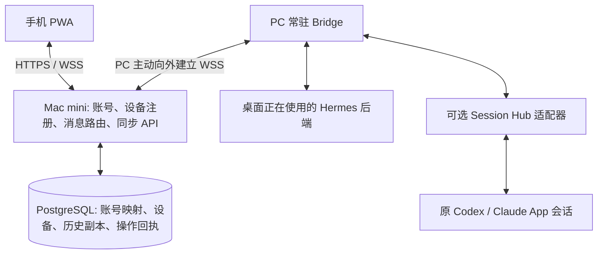

# 自有 Agent 产品：账号、远程会话与移动端开发需求

版本：1.0 · 日期：2026-09-19 · 状态：开发输入，尚未实现或部署。

配套启动指令见 [MACMINI-START-PROMPT.zh-CN.md](MACMINI-START-PROMPT.zh-CN.md)。本文中的架构、默认策略和性能目标是开发要求，不代表已有能力已经通过验收。

## 1. 产品目标与用户需求

基于 Hermes Agent 开发自有品牌产品。用户在 PC 客户端和手机登录同一个产品账号后，可在手机查看账号下已绑定电脑中、授权同步范围内的全部会话，并向原会话继续发送指令，由原电脑使用原工作目录、上下文和工具执行。Mac mini 有公网 IP，承担账号、设备连接、会话同步及消息转发；优先保证中国大陆访问体验。

典型使用：用户在 Windows PC 上让 Agent 修改项目，离开电脑后使用手机查看进度、继续提要求、处理支持的审批；返回 PC 时看到的是同一个 session 和执行结果。

必须保持：原 session 身份、原执行位置、原上下文连续性。不能用摘要创建新会话冒充续接；不能把“请求已接收”展示成“任务已完成”。

“全部会话”包括授权连接和 Profile 的现有及后续会话，不限于当前打开或首屏最近几条。归档可通过筛选查看。仅在桌面内存中的草稿、插件页面、未落盘片段、源端已删除记录、第三方云端未下载会话，不承诺自动恢复或同步；界面应说明缺失原因。

## 2. 交接基线与源码可得性

2026-09-19 已核对的 Windows 工作区：

- 外层目录：`E:/2_GithubSpace/HermesAgent`。
- Git 仓库：外层下的 `hermes-agent/`。
- origin：`https://github.com/MaHsiChu/hermes-agent.git`。
- 本地分支：`main`；HEAD：`d177b119e9c56c9ddc0b7379ffce52341ec06584`。
- 本地桌面 package 版本：`0.17.6`；Python 项目版本：`0.21.3`。新环境以实际文件为准。
- 分析时存在未提交的桌面侧改动，涉及侧栏工作区会话、任务引用等；它们现已归入提交 `6ebd7ef`。Mac 开发以实际拉取的 HEAD 为准，禁止覆盖新环境已有改动。
- Session Hub 现已纳入仓库 `extensions/session-hub/`，相关集成研究见 `docs/session-hub/`。原 Windows 外层副本及其运行数据仍留在本地；clone 可获得源码、测试和文档，但不会获得个人配置、凭据、会话和截图。安装见扩展的 `CHECKOUT.zh-CN.md`。
- 本交接文档现纳入该 Git 仓库的 `docs/remote-control/`，随本次交接提交发布；拉取包含本文档的版本后无需单独传 ZIP。此前生成的文档 ZIP 是创建时快照，只含需求和提示词，不包含项目源码或 Session Hub；以当前 Git 文档为准。

Mac mini 首次启动开发必须核对 origin、HEAD、工作区状态、AGENTS.md 和实际接口。可比较上述提交，但不要为对齐提交号强制 reset、覆盖用户文件或替换已有配置。记录版本差异，优先延续可运行且用户指定的 checkout。

现有复用点（仓库相对路径）：

| 文件或目录 | 已观察到的基础 | 开发时仍需验证 |
|---|---|---|
| `apps/desktop/src/api/sessions.ts` | 会话及跨 Profile 查询 | 所有分页、归档、连接归属与错误提示 |
| `hermes_cli/web_routers/sessions.py` | 历史、搜索及消息读取 | 真实可用的端点、鉴权和消息投影 |
| `tui_gateway/` | 真实会话与 JSON-RPC 后端 | 连接当前桌面实际使用的进程 |
| `apps/shared/src/gateway-contract.openrpc.json` | `session.resume`、`prompt.submit`、`session.steer`、`session.interrupt`、事件回放及审批协议 | 版本契约、并发语义、传输所有权 |
| `tui_gateway/transport.py` | 事件分发基础 | 多客户端同时订阅、慢客户端隔离 |
| `tui_gateway/event_replay.py` | 带序号的有限内存回放 | 重启及缓冲淘汰后的持久化恢复 |
| `extensions/session-hub/` | Codex App / Claude Code 原会话历史及续聊适配 | 源码已随仓库提供；配置、平台及 App 版本重新验收 |

本机 Session Hub 0.4.4 文档记录了原会话续聊及历史功能，同时明确审批、停止和原生 Review 尚未接入。该记录不是 Mac 环境的通过证据；不可将内部 App 接口当作稳定公共 API。Claude 普通 Chat / Cowork 不在已知接入范围。

## 3. 商业化与工程边界

Hermes 顶层许可证为 MIT，允许修改及商业分发，需保留原版权和许可声明。新增代码和产品品牌可独立维护；发布前核查实际打包依赖、插件、素材的许可及第三方服务条款。

使用独立产品名、应用 ID、签名和更新来源；不复用上游发布凭据、不误导为官方产品。品牌尚未提供时使用可配置的临时名称，不因命名阻塞研发。收费、套餐及支付不属于第一版。

优先扩展现有接口或独立插件/服务，避免侵入 Agent 推理循环。保持原缓存和会话隔离规则；确需补充通用接口时，形成小范围、可测试的核心改动。

## 4. 系统架构

- PC 执行端是会话、工具执行和结果的权威来源；模型调用使用执行端已有配置。
- Mac mini 保存可读历史副本与操作日志，不通过直接修改副本操纵原生会话数据库。
- PC 主动连出，无需 PC 公网地址或入站端口；手机只访问产品 HTTPS 入口。
- Mac mini 可以另外注册成执行设备；“服务端”和“执行端”即使在同机，也必须逻辑分离。不能把任务自动迁移到 Mac 执行。
- 不开放全量 Hermes 管理 RPC 的公共透传，仅暴露产品所需、经过鉴权的操作集合。

默认选型：React + TypeScript 手机 PWA；Python Bridge 复用现有 Hermes 接口；FastAPI 业务服务；PostgreSQL 持久化；Caddy 提供 HTTPS。身份提供方采用成熟、可自托管的 OIDC 实现，M0 记录选型与版本，不自创密码学协议。若已有工程基础更适合其他选型，以 ADR 说明后继续开发，避免无必要重写。

建议新模块位置：`apps/mobile/`、`remote_control/server/`、`remote_control/bridge/`、`remote_control/adapters/`、`deploy/remote-control/`。这是提议位置，实施前核对现有目录及 AGENTS.md。

## 5. 功能需求

### F01 产品账号与设备绑定

- 产品账号独立于模型供应商账号、Hermes Profile、Codex / Claude 登录。
- 实现真实注册/登录/退出和账号会话撤销；内测默认邀请注册，保留后续开放注册能力，不使用硬编码单用户或共享长期 token 冒充账号体系。
- 桌面通过系统浏览器进行 OIDC Authorization Code + PKCE 登录；PWA 采用安全的 Web 登录会话。密码、验证和恢复交给选定身份服务；外部邮件尚不可用时明确恢复限制。
- 桌面登录后展示设备名、已连接账号、远程访问开关和同步范围，经明确绑定后同步现有记录。登录本身不应静默上传整机数据。
- 设备使用独立可撤销凭据；用户在手机可查看在线状态、最后在线时间并撤销设备。电脑退出产品账号后停止远程访问。
- 切换账号清除旧账号的设备路由、订阅及手机缓存；不能沿用旧租户的数据或会话。

### F02 会话发现与历史

- 列表支持设备、引擎、Profile、运行状态、归档过滤，支持标题搜索、分页和最近活动排序。
- 会话详情展示 Markdown、代码块、工具调用及输出、错误、时间、所属设备和同步时间；工具过程默认可折叠。
- 先同步元数据和最近消息，再后台分页补全已有历史；展示同步进度。分页不能漏掉较旧或归档会话。
- 本地附件路径映射为受鉴权的资源引用；源端不可读、过大、未同步、已删除分别显示状态，不能承诺源头没有的数据。
- 同源消息的更新应原位更新，删除/归档需要版本与 tombstone，避免旧同步重建已删除记录。

### F03 向原会话发送并观察结果

- 手机选中会话后，向原设备、原引擎、原 Profile、原 session 发送消息。电脑和手机看到同一轮结果。
- Hermes 运行中支持显式选择“追加到当前工作”或“排队下一轮”；具体能力按后端探测结果提供，禁止暗中改变语义。
- 同会话写操作由执行端排序，冲突返回明确状态；多设备会话不能误路由到默认连接或同名 Profile。
- 输入框展示发送中、接收回执、运行、完成、失败、等待审批或投递待确认。用户草稿不能因切换会话或短暂断线丢失。
- 第一版无需提供远程任意 shell 页面；通过原 Agent 的工具和审批执行任务。

### F04 断线、离线与后台运行

- 手机后台或网络切换后可重连，先恢复快照及游标，再续接增量；重复事件去重。
- PC 离线时可查看已同步历史并显示最后同步时间。第一版保存草稿，不自动执行离线期间输入；用户在设备上线后再次发送。
- 已在 PC 运行的任务遇到手机断线应按原执行策略继续；是否仍在运行由执行端证据确认，不能仅凭云端连接状态推断。
- 桌面退出时显示“关闭窗口继续后台执行”和“停止后台服务”的明确区别；Bridge 及执行后端的生命周期需要统一设计，Bridge 单独在线不代表 Agent 在线。
- 连接已运行的桌面后端，禁止为接入手机启动第二个共享同一 state.db 的独立执行实例。后端重启后执行状态先核对再恢复。
- PC 关机不能执行本机工作，Mac 中转不能代替原电脑或自动唤醒它；任务迁移和唤醒不在第一版。

### F05 审批、停止与能力声明

- Hermes 在协议支持范围内提供手机审批、澄清、停止；保留执行端原有审批策略，不因为远程接入自动放行。
- 审批绑定设备、session、turn、原请求 ID 和有效状态；双端竞争答复仅接受第一个有效结果，其余显示已处理或过期。
- 普通日志/历史不存储 sudo 密码、模型密钥等秘密；首版可将秘密输入限定到本机，并在手机提示原因。
- 每个适配器发布能力：`history`、`send`、`steer`、`interrupt`、`approval`、`attachments`，区分 supported / unavailable / unsupported，并附原因。
- Codex / Claude 控制仅通过实际允许、已认证的引擎或 App 接口；不伪造 App 控制身份，不写原生数据库注入指令。
- 缺少 Session Hub 源码或 App 环境时继续 Hermes 主链路，提交适配协议和缺口说明；不能将 mock 适配器标为真实接入。

### F06 附件与移动体验

- 360px 宽度下支持列表、详情、输入和审批，键盘弹出不遮挡发送按钮；支持 iOS Safari 与 Android Chrome 的实际验证。
- 图片缩略图优先，原图按需读取；上传限额、MIME、大小、路径边界和授权需要校验。初版建议每张图片 8 MB、每条最多 5 张，作为可配置产品限制。
- 手机上传由服务端受控暂存并转到目标 PC，再按引擎实际方式附加；不将 Windows 路径直接当成手机 URL。
- 长工具输出分页或按需展开，展示是否截断以及可获取完整内容的入口。
- 不让第三方字体、CDN 脚本或第三方登录资源成为国内页面基本加载的隐含必需依赖；随应用打包基础静态资源。
- 完成和等待审批先做站内通知；后台推送后续实现，不能承诺浏览器关闭后 WebSocket 仍在线。

## 6. 数据与协议要求

### 6.1 最小数据模型

| 实体 | 关键字段与约束 |
|---|---|
| users | 产品 user_id、OIDC issuer + subject 唯一映射、状态 |
| devices | device_id、owner_user_id、显示名、凭据版本、撤销状态、last_seen |
| backends | device_id、backend_id、profile_key、engine、能力、运行实例标识 |
| sessions | 产品公开 ID、原生 session_id、归属、标题、状态、同步版本、删除标记 |
| messages / events | 会话归属、原生 message_id、revision、event_epoch、seq、payload、来源时间 |
| commands | request_id、操作摘要 hash、归属、目标、状态、执行端回执、时间及错误 |
| subscriptions / cursors | 客户端订阅范围、已确认游标；不能作为数据授权依据 |
| attachments | 归属、对象 ID、媒体属性、大小、同步状态、清理策略 |

源会话定位键至少包含 `(device_id, backend_id, profile_key, engine, native_session_id)`，并在服务端校验其账号归属。不能信任客户端传入的 user_id。跨 Profile 的聚合是读取方式，不会消除原执行隔离。

### 6.2 对外 API 草案

以下是待实现的产品 API，不是已经存在的 Hermes 端点：

- 登录/退出/回调、当前用户及会话撤销。
- 设备注册、列举、撤销；源执行端发现及能力查询。
- 会话列表、历史分页、同步状态、附件读取。
- `POST /api/remote/sessions/{id}/commands`，操作限定为已支持的 send / steer / interrupt / approval-response。
- `GET /api/remote/commands/{request_id}`，用于回执核对。
- 手机事件订阅 WebSocket；Bridge 专用、身份受限的出站 WebSocket。

路由在实施时定稿并生成契约。消息至少包括协议版本、request_id、目标、操作类型、payload 和过期约束；事件包含稳定来源 ID、epoch 与 seq。用户归属由已认证身份推导，不能以 payload 覆盖。

### 6.3 投递和重放

- 请求幂等键在服务端和执行端均持久化，按账号及目标作用域去重；相同键不同正文返回冲突。
- RPC 请求编号不等于业务幂等键。检查现有 `prompt.submit` 等操作是否具备持久化去重；没有就增加可关联执行结果的最小接收机制。
- 接收日志应先落盘，再调引擎，成功关联原生 turn/消息 ID 后更新回执。
- 执行副作用与日志更新之间发生崩溃时可能无法确定结果。不能声称对任意工具实现 exactly-once；标记 `delivery_uncertain`，核对原会话，禁止盲目重发。
- 建议操作状态：accepted → dispatching → acknowledged → running → completed / failed / needs_attention；不确定窗口进入 delivery_uncertain。取消请求已发出不代表执行已停止。
- 状态变化使用版本和条件更新，旧回执不能把 completed 改回 running。
- Hermes 内存回放用于短断线；持久化历史与快照用于长断线和重启。epoch 改变、游标失效、事件淘汰时重新对账。
- 慢手机只影响自身订阅，不阻塞 Agent 或其他客户端；队列有界，溢出触发可见的补读流程。

## 7. 安全与数据策略

- HTTPS/WSS；手机和 Bridge 使用不同认证入口及权限，Bridge 凭据仅代表绑定设备。
- 服务端每个读取、订阅、写入、附件操作均校验账号及设备归属；仅知道 ID 不能获取数据。
- Web 会话 Cookie 设置 Secure / HttpOnly / 合适的 SameSite，并落实 CSRF、WebSocket Origin 校验和认证更新。
- 用户退出、账号禁用及设备撤销须使已有长连接失效；短期访问凭据配合可撤销会话，禁止只等 token 自然过期。
- 本地凭据使用平台凭据库或严格权限文件；服务器配置和密钥不入 Git。发布日志不打印 token、完整用户提示词或附件正文。
- 产品默认允许自有服务端持有可读的会话副本，以支持 PC 离线阅读；磁盘/备份保护必须落实。这不是端到端加密方案，界面需明确同步行为。E2EE 是后续独立需求。
- 设备撤销立即停止后续访问和同步；历史清理另提供明确动作，删除会话应清理副本及附件，备份保留期记录在运维文档。
- 文件下载限制在明确授权资源范围；不允许借任意文件路径或远程 URL 读取服务端秘密。

## 8. Mac mini 部署与国内网络

必须调查而不臆测：Mac 所在地区、运营商、公网 IPv4/IPv6、端口可达性、实际上行、域名、设备架构、磁盘空间、现有服务和容器运行时。

- 单机部署业务 API、身份服务、PostgreSQL、Caddy；不要求 Kubernetes、Redis 或模型 GPU 作为第一版前提。
- 提供固定版本的部署配置、`.env.example`、数据库迁移、启动/停止/健康检查和备份恢复命令。
- 优先利用已安装的容器运行时；macOS 重启后的容器/进程启动链需要真实验证。无容器时明确原生部署与 launchd 方案，不默认 Docker 会在无人登录时自动可用。
- 使用域名和有效证书；无域名时继续 localhost 开发和本机 E2E，不把 HTTP 开放到公网冒充正式上线。
- 保留已有服务；不要自动修改整机防火墙、路由器端口或系统休眠策略。给出具体配置项，依据所在环境已有授权执行。
- Mac 断电/休眠会中断远程服务；备份到不同故障域，演练恢复。中转重启不能导致 PC 重复执行指令。
- 提供健康端点和日志轮转。日志区分手机连接、Bridge 在线、引擎可用、任务执行四种状态。
- 国内访问不承诺由“公网 IP”自动保证，分别测试手机→Mac 和 PC→Mac；境外 Mac 需要额外评估跨境线路。

### 8.1 带宽预算与优化

规划估算：普通文字及工具状态按每个持续输出会话 2～10 KB/s，则 10 路约 0.16～0.8 Mbps、100 路约 1.6～8 Mbps，不含附件和异常大量日志。该数字不是现有实现基准。一个会话被多端同时观看，会增加出口副本。

5 MB 图片在 10 / 30 / 100 Mbps 可用上行下，理论耗时约 4 / 1.3 / 0.4 秒，尚未计协议、拥塞和重传。家庭套餐的下载速率不能作为上行预算。

按需订阅、分页、增量、缩略图、附件限速和背压为首版要求；严禁按 token 重发完整历史。大文件与消息控制通道分开调度。日后附件可迁到对象存储，账号/中转也可迁云，不能写死家庭 IP。

### 8.2 可测性能目标

在目标 Mac 上，先记录实际硬件与网络。以下为开发目标，不是公网 SLA：

- 负载基线：10 个绑定设备、20 个手机在线连接、10 路同时文字输出（每路 10 KB/s），连续 30 分钟无无界队列或持续内存增长；空闲连接不得全量轮询历史。
- 用上述负载测业务进程、数据库、身份服务、总 CPU/RSS 及出入口流量，报告真实值，不据此外推“支持几千用户”。
- 可控测试环境中，手机↔中转、Bridge↔中转每段 RTT 均不超过 100 ms、无主动丢包且资源不饱和：命令收到执行端持久化接收回执 p95 ≤ 1 秒，已生成事件到可见渲染 p95 ≤ 500 ms，排除模型生成时间。
- 网络恢复后，不需重新登录的客户端 5 秒内发起重连并开始状态恢复；大量历史补读单独报告耗时。
- 首次历史同步使用至少 1,000 个合成会话和一个 10,000 条消息的长会话，验证分页完整性与可中断续传，不要求一次下发到手机。
- 加入断网、重复帧、乱序/过期回执、带宽受限和附件抢占测试。
- 国内真实网络验收记录地区、运营商、时段、RTT/失败率及应用回执 p50/p95。没有实际线路测试则注明未验证，不用局域网成绩代替。

## 9. 开发里程碑

| 阶段 | 交付 | 完成门槛 |
|---|---|---|
| M0 基线与决策 | 环境报告、版本记录、接口探测、身份方案 ADR、实施清单 | 找到真实后端连接方式，说明缺失源码及环境；不只停留在调研 |
| M1 Hermes 原生闭环 | 独立账号、设备绑定、出站 Bridge、手机列表/历史/发送/流式结果、基本部署 | 两个真实客户端连接同一后端；手机驱动原 session，PC 看到同一轮；账号隔离测试通过 |
| M2 可靠性与可用性 | 全历史分页同步、离线阅读、持久化回执、双端并发、撤销、Hermes 审批/停止、附件 | 故障矩阵通过；macOS 服务重启恢复；有 Windows 真机执行端证据或明确待验项 |
| M3 当前全部会话范围 | 接入仓库内 Session Hub，统一 Codex / Claude 展示及能力 | 每种引擎分别证明历史和原会话续聊；不支持的审批/停止明确禁用 |
| M4 产品交付 | 独立品牌配置、安装/更新、网络验收、备份恢复、运维手册 | 可复现部署与目标设备验收；第三方许可清单 |

第一轮立即实施 M0→M1，M1 后继续推进 M2；Session Hub 已有源码；第三方 App 环境缺失不阻塞前两阶段，但 M3 缺失时不能声称完成“全部会话”产品目标。公网或 Windows 环境暂不可用时继续可独立完成的开发，并列出剩余验收。

## 10. 验收用例

| ID | 场景 | 通过标准 |
|---|---|---|
| A01 | 两个产品账号 | B 无法读取/订阅/控制 A 的设备、会话或附件，猜 ID 也失败 |
| A02 | 绑定与撤销 | 绑定后可发现设备；撤销后现有连接及后续请求均失效 |
| A03 | 原会话连续性 | PC 先发送上下文标记，手机原 session 引用标记并继续，PC 获得同一轮结果；不是新会话 |
| A04 | 全部范围 | 多设备、两个 Profile、归档、长历史均可分页查到，来源和隔离正确 |
| A05 | 双端并发 | PC/手机同时发送、steer/队列、两端审批答复时有稳定顺序和明确结果 |
| A06 | 手机掉线 | PC 继续执行，手机重连后补齐消息、工具结果和任务状态，无重复展示 |
| A07 | PC 离线 | 显示离线及最后同步时间，历史仍可读，草稿不被误当作已发送 |
| A08 | 回执丢失/崩溃 | 在投递前后及执行回执前后故障注入；可去重或进入投递待确认，绝不盲重发 |
| A09 | 服务端重启 | 历史/设备/回执保持；Bridge 重连，已执行工作不重复启动 |
| A10 | 后端重启/缓冲淘汰 | epoch/游标变化触发对账，旧运行状态不会无限卡住 |
| A11 | 审批/停止 | 权限策略保留；过期审批不可重放；停止只在引擎确认后标记成功 |
| A12 | 附件 | 手机读图/上传到目标 PC 正确；非法路径、跨账号访问、超限文件被拒绝 |
| A13 | 账号切换 | 不残留前账号历史、缓存、路由或订阅 |
| A14 | macOS 与 Windows | 平台相关常驻、凭据、路径在真实系统测试，不 mock 操作系统假称通过 |
| A15 | Codex / Claude | 各自实际原会话续聊验证；接口不可用给明确原因，不冒充新建/摘要续聊 |
| A16 | 国内线路与负载 | 按第 8 节测量并附条件、结果、失败样例与未测项 |

真实执行验收使用隔离项目和临时 HERMES_HOME，可以在测试目录写入唯一标记证明执行端；不得对用户正式项目自动提交、删除或运行破坏性命令。模型凭据缺失时可做契约测试，但必须将真实模型及设备验收单列为待完成。

## 11. 开发规范与交付件

- 阅读根及目标目录 AGENTS.md；使用现有依赖锁和支持的运行时，不复制 Windows `.venv` 或 `node_modules` 到 Mac。
- Python 测试遵循 `scripts/run_tests.sh`；前端按实际 package 脚本执行。新增测试验证归属、投递、恢复等行为，不以源码字符串检查充当功能验收。
- 保护已有工作区改动，必要时用隔离 worktree；只提交本功能文件，提交或推送遵循用户授权。
- 每阶段交付代码、协议、迁移、部署配置、精确启动命令、测试结果和已知限制。
- 在本文目录维护 `IMPLEMENTATION-STATUS.zh-CN.md`，逐阶段写入真实状态、运行命令、证据位置和下一步；不提前勾选完成。
- 输出脱敏验收报告，区分源码支持、自动化通过、本机运行、Windows 真机、手机真机及公网网络验收。
- 不把注册空壳、假会话、mock 回复、仅 localhost 可见的截图当成产品闭环。

## 12. 非阻塞假设与待确认信息

默认手机 PWA、中文界面、内测邀请账号、自有服务器保存可读副本、第一版离线只保存草稿。上述为建议默认值，不等于用户逐项作出最终产品选择；实现需保持可配置，并在状态文档记录。

需要用户或环境补充：正式名称/域名、Mac 网络位置与上行、允许使用的身份服务与邮件配置、目标 Windows PC 连接方式、可用于隔离验收的模型配置、数据保留策略。先从本机实际环境读取非敏感信息；缺失时继续本地开发，不要求用户在聊天中粘贴密钥。

## 13. 参考资料与证据边界

- [Hermes 上游 MIT](https://raw.githubusercontent.com/NousResearch/hermes-agent/main/LICENSE)
- [当前 fork MIT](https://raw.githubusercontent.com/MaHsiChu/hermes-agent/main/LICENSE)
- [RFC 8252：原生应用 OAuth](https://www.rfc-editor.org/info/rfc8252/)
- [RFC 9700：OAuth 安全实践](https://www.rfc-editor.org/info/rfc9700/)
- [Caddy HTTPS 配置](https://caddyserver.com/docs/quick-starts/https)
- [延迟、带宽与吞吐区别](https://www.cloudflare.com/learning/performance/glossary/what-is-latency/)

本文来自当前会话的需求确认和本地源码检查。没有实际连接 Mac mini，也没有完成任何新增功能、容量测试或公网验收。上游版本及第三方接口可能变化，开发启动时按实际环境重新核对。
