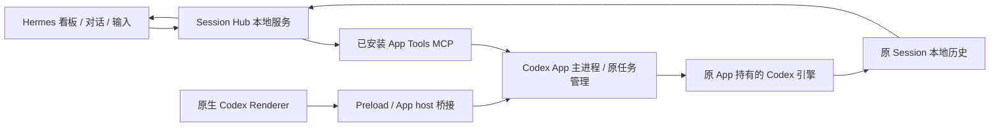

# Codex 原任务在 Hermes 内打开与继续处理

> 历史研究记录：原 Windows 本地验收 JSON、截图、运行绑定未公开。源码现在位于 `extensions/session-hub/`；新 checkout 安装和平台限制见 [交接说明](../../extensions/session-hub/CHECKOUT.zh-CN.md)。

核验日期：2026-09-18。范围：本机 Windows Codex、Hermes Session Hub、本机官方工具目录与生成的 App Server 协议。

## 结论

**可以在 Hermes 内继续同一个 Codex 任务；目前不能把这个能力等同于完整嵌入 Codex 原生界面。**

检测为 Codex 的任务现在仍默认在 Hermes 中打开：居中的消息区、可折叠工具记录、底部输入框、原任务状态、关闭/开启标记、独立的“在 Codex App 中打开”按钮。消息通过已安装的 Codex App Tools 发给同一 `threadId`，由原 App 执行。本轮已用既有验收任务验证发送、完成和历史回显，没有创建新任务。

图 3 涉及的不只是聊天记录，还包括编辑文件/Review、附件、模型与权限控件、审批、原生侧栏等。没有找到官方提供的可直接嵌入其他 Electron 应用的 Codex 会话组件。这里的判断针对下述安装版本和已核验接口，不是宣称未来或所有版本都不可能实现。

## 1. 实际安装与执行架构

| 层 | 本机证据 | 对集成的影响 |
|---|---|---|
| Windows 包 | `OpenAI.Codex_26.915.3509.0_x64__2p2nqsd0c76g0` | MSIX 版本与内部 package 版本不同 |
| Electron 包 | `openai-codex-electron`，`26.915.31029` | 主入口 `.vite/build/early-bootstrap.js` |
| Renderer | `webview/assets/local-conversation-thread-*.js`、turn/blocks/page 分块 | 会话是桌面前端的一组组件，不是一个独立可调用的 HTML 文件 |
| Preload | 向页面暴露 `electronBridge`，`sendMessageFromView` 进入 `ipcRenderer.invoke` | 直接加载网页资源不会自动获得主进程能力 |
| App host | `connect-app-host` 把 MessagePort 转交 Electron 主进程 | 同源页面消息和宿主连接也是运行依赖 |
| 执行引擎 | 当前运行进程使用 `AppData/Local/OpenAI/Codex/bin/cdef5aaf3e41ab53/codex.exe` | 实际可执行版本为 `codex-cli 0.155.0-alpha.9` |
| 本机连接 | App 引擎进程未指定 `--listen`；对应实现默认 stdio | 当前 App 的引擎不是一个已公开给 Hermes 的共享 WebSocket 服务 |

本机静态代码中最关键的条件在 `.vite/build/src-BO6ySiRL.js` 约字符偏移 937345：使用共享 local daemon 的分支要求 `process.platform !== 'win32'`，还要求 local host、显式 daemon 开关及其他配置条件；否则建立 stdio transport。`app-server daemon version` 在本机默认控制 socket 上也连接失败（OS error 10050）。因此本轮不能把 `app-server proxy` 当成 Windows App 的可用附着接口。

这两项证据支持“当前安装不能通过默认 daemon 接入”，不能推出 Codex 在其他系统、远程模式或未来版本都不支持共享连接。



App Tools MCP 和 App Server 是不同的协议层。前者是本机桌面管理工具，后者是执行引擎的客户端协议。不能把其中任意一个当成完整 UI 组件。

## 2. 原任务身份、历史和执行所有权

需要分别判断三件事：

1. **同一任务身份**：发送到既有 `threadId`，没有 fork、create 或复制历史。当前接入满足。
2. **同一运行中的引擎**：当前方案由 Codex App 自己发送/执行消息，沿用它持有的任务，而不是在 Hermes 另起 CLI 抢占历史文件。
3. **同一界面与全部能力**：需要原 Renderer、桥接宿主、侧栏、编辑器、审批等一起工作。当前 Hermes 页面是自己的展示层，不满足这一项。

单独启动 `codex app-server` 并 `thread/resume`，可以成为另一套正规的 Codex 客户端；但“读取同一份历史”不证明它接入了 App 已经加载的运行实例，也不保证 App 自有工具和界面状态都被迁移。现有 Session Hub CLI 路径已有 writer ownership 检查；此次原任务续聊没有走该交接路径。

本机 App Tools 的 `send_message_to_thread` 接受 `threadId`、`hostId`、`prompt` 以及可选模型/推理参数。此次前端只提交前三项，保留原任务配置。验收历史把来自 App Tools 的输入记为跨会话指令，因此 Hermes 如实显示“跨会话指令”，没有伪造为用户在原输入框直接键入的消息。

## 3. 已核验的接口覆盖

下表 App Server 列依据本机 CLI 生成的实验性完整 schema；“存在协议”不等于“当前 App Tools 已转发”。

| 能力 | App Server 方法 / 事件 | 当前 App Tools | Hermes 本轮 |
|---|---|---|---|
| 原任务续聊 | `thread/resume`、`turn/start` | `send_message_to_thread` | 已接入，保持原 ID |
| 运行中追加指令 | `turn/steer` | 同一个发送工具由 App 处理 | 沿用既有 App 通道；本轮验收覆盖空闲任务续聊 |
| 读取 / 状态 | `thread/read`、`thread/loaded/list`、turn 通知 | `read_thread`、`wait_threads` | 本地完整历史每 3 秒读取；看板轮询状态 |
| 逐 token 输出 | `item/agentMessage/delta` | 未发现通用事件订阅工具 | 尚未接入；当前是持久化记录同步 |
| 停止 | `turn/interrupt` | 工具目录没有对应操作 | 在 Codex 处理 |
| 命令 / 文件审批 | `item/commandExecution/requestApproval`、`item/fileChange/requestApproval` | 没有审批应答工具 | 在 Codex 处理 |
| 问题表单 | `item/tool/requestUserInput` | 没有原任务问题应答工具 | 在 Codex 处理 |
| 权限请求 | `item/permissions/requestApproval` | 没有对应应答工具 | 在 Codex 处理 |
| 变更 / 计划 | `turn/diff/updated`、`turn/plan/updated` | 没有完整事件流接口 | 展示已落盘工具/变更记录，非原生 Review |
| 改名 / 归档 | `thread/name/set`、`thread/archive` | `set_thread_title`、`set_thread_archived` | 目录中有；本轮未新增 UI 接线 |
| 看板关闭标记 | 不属于执行引擎状态 | 不需要 | 已有，独立保存，不停止/归档原任务 |
| 附件 / 图片输入 | App Server 有结构化输入 | 当前发送工具参数仅 prompt 文本 | 已支持本机图片上传、原任务工具读取、历史缩略图；非原生多模态输入 |
| 原生打开 | 桌面路由，不是引擎 API | `navigate_to_codex_page` | 独立按钮；固定 `codex://threads/<id>` 激活请求 |

原生打开的“已提交激活请求”仍不等于操作系统一定允许前台抢焦点。本轮没有把焦点控制验证扩展为完整桌面自动化验收。

## 4. 四种集成路线

| 路线 | 能保留什么 | 必须承担的条件 / 限制 | 判断 |
|---|---|---|---|
| 原生打开 | Codex 原界面、全部原生控件和执行上下文 | 用户离开 Hermes 主窗口 | 保留作完整能力入口 |
| 复制 Renderer 到 Hermes WebView | 理论上可复用某个版本的前端代码 | 还须适配 Electron IPC、App host、worker、共享状态、文件/浏览器等宿主服务；升级即可能变化 | 没有验证为可用组件，不作为已支持路线 |
| 将 Codex 原窗口挂进 Hermes | 保留原窗口像素和交互的可能性 | 这是整个原生窗口嵌套，不是按 Session 组件化；焦点、DPI、弹窗、拖拽、跨窗口导航需单独验证 | 未实施、未验证，不能称为完整嵌入 |
| Hermes 自建 App Server 客户端 | 正规 Codex 执行引擎、消息、工具、审批/中断协议 | Hermes 需拥有/附着被授权的引擎连接，自建 UI，并明确原任务移交边界 | 补齐功能的长期路线，不会自动获得原 App UI |

官方把 App Server 定位为产品客户端集成层，应用持有自己的 UI，引擎提供执行与审批能力：[App Server 文档](https://developers.openai.com/codex/app-server)、[Codex as a platform](https://developers.openai.com/blog/codex-as-a-platform)。这些文档说明了可复用的引擎接口，没有证明可嵌入原桌面 Renderer。

## 5. 本轮具体落地

- Codex 卡片仍在 Hermes 打开，单独按钮打开原 App，符合用户选定的默认行为。
- 详情调整为居中对话流和底部输入框；工具输出可展开。底层事件和来源 JSON 默认收起到上下文记录，减少调试视图干扰。
- 输入保存在任务/host 维度的本地草稿中；`Ctrl/⌘ + Enter` 提交。
- 请求提交前持久化 `request_key` 与原文；HTTP 回执丢失后，核对仍使用原请求，服务端按键去重。
- 双击发送受互斥保护；消息只发给当前 Session，不自动创建替代任务，不退回 CLI。
- 显示排队、发送、已接收、运行、结束、需处理和结果未知等投递状态。完成仅表示一轮结束，不代表任务目标被验收。
- 审批/停止能力在输入框旁说明，并保留原生入口；没有绘制实际不能工作的假控件。

本轮未实现：原生 Renderer 嵌入、审批应答、停止执行、原生多模态附件参数、原生 Review/编辑器、逐 token 流、云端未落地完整历史。当前绑定还依赖运行中的 Codex App 和已绑定控制任务的 App Tools 通道；App 重启导致绑定失效时应报错重新绑定，不应悄悄切换执行方式。控制任务自身有发送保护，不能在此通道自我递归发送。

## 6. 验证与证据

1. **真实服务闭环**：浏览器加载真实插件，调用现有本地服务，向既有验收任务 `01a0b3a9-1834-7140-8393-0f167c52b8f1` 提交一次文本；原 Codex 任务完成；原历史出现对应助手回复。结果见 `extensions/session-hub/codex-conversation-live-results.json`。测试只要求回复随机标记，不读写文件，不新建 Session。
2. **交互模拟**：模拟服务已经排队但 HTTP 回执丢失；重开详情、核对结果仍提交同一请求，只有一个投递任务。保持默认 Hermes 打开，显式按钮才触发原生跳转。
3. **回归**：27 项 Python 测试、7 项看板模型测试、看板浏览器交互测试、原时间线分页/增量/工具/Markdown/图片/导出测试通过。模拟组件验收与原 App 闭环分别记录。
4. **部署**：重新打包并复制到运行中的 Hermes desktop plugin，源文件同步至安装目录。无后端协议修改，无需重启服务。已打开的旧任务页可能仍持有旧组件，重新从看板点开该任务即可加载新视图。
5. **真实窗口样式**：运行窗口只读探针确认中性背景仍正确、单份 adopted 看板样式、无旧 DOM 看板样式；这不是完整原生 UI 操作验收。

复现研究：

```powershell
node extensions/session-hub/research-codex-app.mjs '<安装位置>/app/resources/app.asar'
& hermes-agent/.venv/Scripts/python.exe extensions/session-hub/research-app-tools.py
& '<实际 Codex CLI 路径>' app-server generate-json-schema --out reports/codex-integration/schema --experimental
```

本目录 `installed-architecture.json` 保存包信息、静态代码短片段、字符偏移和每个命中文件 SHA-256；`app-tools-catalog.json` 保存安装工具 schema；`schema/` 保存本机 CLI 输出的协议。研究脚本只读安装文件/目录，不执行提取代码、不修改 Codex 包、不记录管道凭据。

后续若继续推进功能对齐，应首先解决**被授权的共享引擎连接或明确的原任务移交**，再实现请求/通知路由、断线重连、审批表单、中断、附件和差异视图。仅继续调整 CSS 无法补齐这些运行时能力。


## 7. 2026-09-19 阅读与图片输入更新

已加入居中正文、右侧深色用户气泡、图片缩略图、大图弹窗（Esc 关闭）、复制消息、代码块复制、表格滚动、执行过程分组折叠和增删行配色。助手最终回复保持展开。来自 Hermes 的续聊按用户消息展示，来源记录仍保留原 App 的跨会话投递事实。保留阅读位置，位于底部时跟随新增记录。

输入框支持粘贴、文件选择和拖放静态 PNG/JPEG/WebP，每张最多 8 MB、3200 万像素，每条最多 5 张，支持纯图片发送。图片规范化后保存在 `extensions/session-hub/data/attachments/<session_id>/`，同任务内按不可猜测 ID 读取，发送前核对文件哈希。图片元数据和草稿随任务保留；移除缩略图只从草稿解除关联，文件保留以支持历史消息。发送失败核对保持同一 request_key 和图片列表，避免重复排队。

**传输边界**：当前 App Tools 的 `send_message_to_thread` 仍只有文本 prompt 参数。Hermes 将受控本地图片路径附加到原任务提示中，请原任务用图片查看工具读取；不是 `turn/start.input` 的原生 `image/localImage` 参数。仅支持本机原 Codex 任务，远端附件明确拒绝。原权限保持不变；如果原任务无法读取路径，必须报告失败。参见 [官方 App Server 输入协议](https://developers.openai.com/codex/app-server) 与 [图片输入文档](https://developers.openai.com/codex/image-inputs)。原生审批、停止、Review 和逐 token 事件流仍未接入。

验证分层：

- 30 项 Python 契约回归通过，涵盖图片格式、跨 Session 拒绝、文件变化检测、图片单独发送、相同请求去重和原历史回显。
- 浏览器组件验证了粘贴 / 选择 / 拖放、移除、Esc 预览、草稿恢复、图片发送丢失回执后复核、不重复发送和无效图片拒绝。模型分组测试验证不跨用户消息、最终回复和 turn 合并。
- 真实服务闭环仍使用既有验收 Session `01a0b3a9-1834-7140-8393-0f167c52b8f1`，上传测试图片且仅发送一次。原 Codex 正确回答 `Left: red triangle. Right: blue circle. Label: Q7M4.`；回复与图片缩略图同步回 Hermes。证据为 `extensions/session-hub/image-acceptance-result.json` 和 `codex-image-live.png`。未新建任务，未向业务任务发送测试内容。
- 服务已更新为 0.4.2；只在 Hub 队列空闲时重启 Hub 侧车，没有重启 Hermes 或 Codex。桌面插件热更新；旧任务页重新打开可加载新组件。上述浏览器验证使用真实插件和真实 App 服务，不代表已逐项验收真实 Electron 窗口全部交互。


## 8. 2026-09-19 本地文档链接与每轮修改列表修复

本地文档链接此前被前端组件主动降级为普通文字。现保留链接外观，点击后在 Hermes 内预览 Markdown 或 UTF-8 文本，支持 `/E:/...`、`E:/...`、相对路径、空格转义和行号后缀。读取只允许原消息中明确出现的链接，拒绝网络文件、不支持的文件类型和超过 2 MB 的文件；HTML 作为源文本展示，不执行文件。预览的是磁盘上当前文件内容，不是历史快照。

修改文件列表现在展示在该轮最终回复下方：默认显示前三个文件、完整文件数及增删统计，可展开其余文件并查看每次实际变更。列表按原 Session 的 turn_id 读取完整变更记录，独立于消息分页，不从回答文字或当前 Git 状态猜测修改。新增 / 删除文件的原生记录是全文，更新文件是统一差异，统计和着色分别处理。同一路径重复修改聚合展示；被拒绝的修改不计入。当前列表为该轮已记录的编辑汇总，未提供撤销或原生 Review 操作。

真实原任务只读验收：用户截图对应回复准确显示 **8 个文件，+220 -3**；“能力与验收记录”可点击打开本报告，列表展开到全部 8 个文件，文件行可展开差异。证据：`extensions/session-hub/artifacts-live-results.json`、`document-preview-live.png`、`changed-files-live.png`。浏览器使用实际插件与真实本地服务，未向原任务发送消息。33 项 Python 测试、原看板交互和时间线回归通过。侧车服务版本 0.4.3，前端热更新后重开对应任务页生效。
