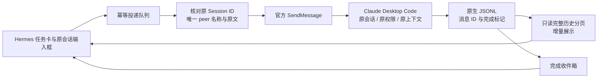

# Claude App 原会话接入与验收

2026-09-19 · Session Hub 0.4.4 · Windows

Claude Desktop **Code** 已接入 Hermes 的统一看板和原会话续聊界面。共享的是同一原生 Session 的落盘历史；向该会话发送官方跨会话消息，让其沿用自身上下文继续工作。

## 体验入口

1. Hermes → **统一看板** → 快捷筛选 **全部任务** → 会话范围 **包含近期历史**。
2. 搜索 `Hermes-Live-Protocol-Test` 可体验已验收任务；也可选择自己的 Claude Code 历史会话。
3. 点击卡片在 Hermes 内阅读、翻页、导出完整本地记录。底部输入框 **发送到原任务**；Ctrl + Enter 也可发送。
4. 若目标离线，点 **在 Claude App 中打开**，待原会话启动后发送。CLI 历史没有 Desktop ID 时明确提示先在 Claude 导入，不自动替换为另一个会话。
5. Claude 继续执行，Hermes 约每 3 秒刷新历史，约每 5 秒核对完成。完成收件箱会记录结果；需要权限确认或停止时在 Claude 操作。

新建：选择 **新建任务 → Claude Code → 原生 App → 在 Claude App 准备草稿**。草稿在 Claude 中预填，检查工作目录并点发送后，刷新 Hermes 看板即可看到真实会话。草稿不会冒充已开始的任务。选择 **原生 CLI** 则使用既有独立 CLI 通道。

## 实际链路

通过 `.claude/sessions` 公开注册字段发现活跃目标，校验进程 PID 和创建时间。Desktop 元数据映射 `local_*` App ID 到原生 UUID。接收方实际消费本次 `msg_id` 后才显示处理中，随后匹配完成标记；旧回复不会使新任务完成。扫描游标持久化，不受 2 MB 尾部摘要窗口限制，半行保留至写完后解析。

发送前离线或同名歧义会明确拒绝。发送中断线不会自动重试；同一请求键可查询已有结果。原生历史只读；不修改 Claude 全局权限、不绕过原 App 入站规则。

新建预填使用官方 [Claude Desktop 链接](https://support.claude.com/en/articles/14729294-open-claude-desktop-with-a-link) `claude://code/new?q=...`。打开原任务使用当前安装版本的 OS 任务入口 `claude://code/continue?session=local_<uuid>`；其实现按精确本地 ID 选择已有任务，有功能开关，版本升级需回归。接口只返回“已请求打开”，不伪造 App 导航成功回执。消息使用官方 [跨会话通信](https://code.claude.com/docs/en/cross-session-messaging) 工具。

## 本机实际验收

- Claude Desktop **2.2553.1**，目标 engine **2.1.275**。
- 目标：`Hermes-Live-Protocol-Test`，原生 ID `2a180f82-79ef-4d06-907d-1f00b3b86a31`，App ID `local_2a180f82-79ef-4d06-907d-1f00b3b86a31`。
- 先将此前专用 CLI 测试历史通过 Claude 自身导入入口打开；目标注册来源为 `claude-desktop`，并在原生 Code 窗口显示。后续投递实际发往此 Desktop 进程。
- 第一次通过 Hub 发送，要求复述之前最后一条助手回答，输入中不提供旧答案。原任务返回 `HUB-CLAUDE-SERVICE-OK DESKTOP-0919-OK`，证明旧上下文继续可用。
- 第二次通过真实 Hermes 插件组件输入框，单次投递，原任务返回 `HUB-CLAUDE-SERVICE-OK DESKTOP-0919-OK HERMES-CLAUDE-COMPOSER-0919-OK`。
- 两次回复在 **Claude 原生窗口** 的可访问性树中确认；第二次回复在 **Hermes 插件组件 + 真实 Hub 服务** 的共享时间线中确认，本轮状态为已结束。插件已经安装进正在运行的 Hermes 本地配置。
- 完成收件箱已核对第一次对应 job 和原文；记录见 [实际验收数据](claude-desktop-acceptance.json) 与 [界面实际投递数据](claude-conversation-live-results.json)。[界面截图](claude-conversation-live.png)。
- 40 项 Python 测试、9 项前端逻辑测试、完整浏览器交互回归通过。新增覆盖长输出、半行、错误消息 ID、离线、同名歧义、GUI/native ID、草稿不创建假任务、图片跨引擎隔离、Claude 输入框与打开入口。

## 与 Codex 的差异

| 能力 | Claude 当前结果 |
|---|---|
| 本地完整历史、工具记录、分页与增量展示 | 已接入 |
| 原 Session 文本续聊、保留上下文 | 已真实 Desktop 验收 |
| 完成回传与共享视图 | 已真实验收 |
| 新建 App 会话 | 预填草稿，需在 Claude 点发送 |
| 图片上传与原任务本地路径投递 | 契约通过；Claude 实际识图未验收 |
| 审批、停止、未落盘流式 UI | 保留在原 App |
| Claude 普通 Chat、Cowork、云端未下载记录 | 本版不支持 |

历史正文不由本适配器截断，但源头删除、截断或未保存的内容无法恢复。加密/私有推理不会复制。完整历史可翻页访问，不代表无限历史可同时放入任何模型的上下文。视觉和原生交互不是 Claude App 的一比一嵌入。
