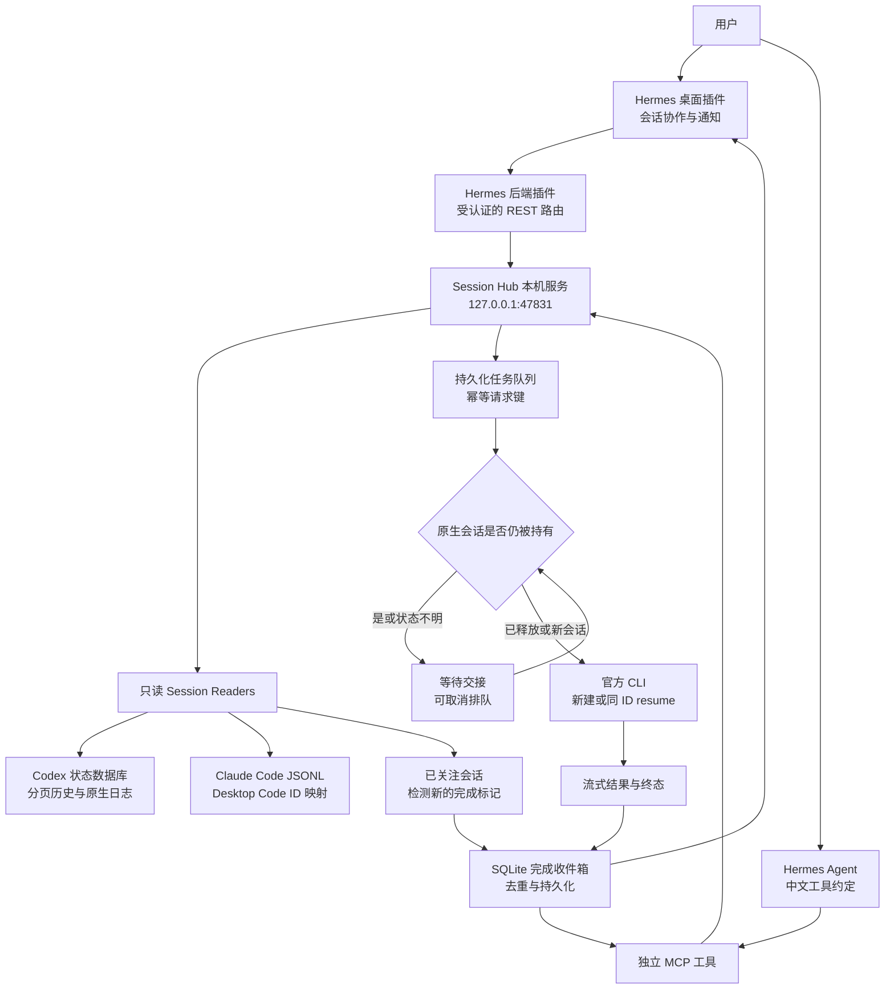

# Session Hub 0.1 历史记录（已由 README 中的 0.2 版本替代）

2026-09-18，第一版 0.1.0。扩展位于 `extensions/session-hub`，通过 Hermes 的桌面插件、后端插件和 MCP 接入，未修改 `hermes-agent` fork 核心源码。

**已接通原生会话读取、任务交接和完成收件箱；尚未实现向两个 App 当前打开的会话实时插话，或在 App 侧栏自动创建新任务。** “同 ID 续接”指同一引擎继续其原生 session，Hermes、Claude、Codex 仍有各自的会话 ID。

## 四项需求的实际覆盖

| 需求 | 已实现 | 当前边界 |
|---|---|---|
| 读取已有 session，接着开发 | 读取 Codex 本地任务和 Claude Code 会话；识别 Claude Desktop Code 的 GUI ID 与 CLI ID；原 ID 调用 resume | 不是把所有历史复制进 Hermes；显示有界的最近消息。云端未落地、归档、Claude Chat/Cowork 不在当前范围 |
| 了解正在开发什么 | 标题、项目目录、最近用户请求、助手回复、工具名、原生执行/完成标记 | 基于本地落盘记录轮询，非桌面屏幕直播；无可靠标记显示未知，锁被占用单独显示 |
| 新建或继续开发任务 | 新建原生 CLI session；原 ID 续接；只读分析或工作区开发；异步队列 | 没有接入 GUI 的私有运行进程。App 持有的 session 等待交接；新建 CLI session 不保证出现在 App 侧栏 |
| 完成后同步 Hermes | Hub 自己的任务自动入收件箱；可关注已有会话，轮询新完成标记；桌面通知、MCP 查询 | 是持久化完成事件和通知，不会自动向 Hermes 当前 LLM 对话插入一轮，也不会自动开始下一个开发任务 |

## 体验入口

1. 双击仓库外层的 `Start-Hermes.cmd`。安装插件前已经打开的 Hermes 需要退出后重新打开，才能加载新增后端路由；“重启消息网关”不是重启桌面后端。
2. 在侧栏选择 **会话协作**，或点击底部 **会话协作**。
3. 搜索项目名、标题或 session ID，点选会话查看历史和状态。
4. 要继续开发，填写指令并选 **开发：允许修改工作区**。仍由原生引擎执行权限约束，不启用 bypass-permissions。默认选项用于分析/评审。
5. 对还在 App 里开发的会话，先点 **关注后续完成**。若发送续开发任务，App 仍持有会话时会显示 `waiting_handoff`；在原 App 结束并释放该会话后才会执行。仅最小化窗口或一轮回复结束不一定释放持有权。
6. 新建任务点 **新建会话任务**，选择引擎及已有的绝对工作目录。执行结果和原生 ID 出现在队列中。

也可在 Hermes 的普通对话直接说：

> 查找 Codex 和 Claude 中标题或路径包含“我的项目名”的已有 session，说明它们最近在做什么，先不要发送任务。

> 关注 Codex 的 session <完整 ID>，把后续完成结果收进会话协作收件箱。

> 在 E:/2_GithubSpace/HermesAgent/playground 新建一个 Claude 开发 session，创建 demo.md 并写入你好。允许工作区写入，任务完成后告诉我结果。

> 读取刚才 session 的上下文，使用同一个原生 ID 继续修改 demo.md，追加第二行。

Hermes 会使用 `hub_sessions`、`hub_read_session`、`hub_dispatch`、`hub_jobs`、`hub_watch_session`、`hub_completion_inbox`、`hub_cancel_queued`。提交任务立即返回排队状态；完成后通过查询结果或桌面收件箱查看。观察事件的 cursor 按消费者独立保存，不会被另一个消费者读取后清空。

## 扩展结构与流程



这是一个本地协调层，不替换 Hermes 的感知、记忆或决策循环。外部会话属于观测数据；Hermes 根据用户指令决定是否派发。任务队列记录派发状态，原生引擎仍负责执行，完成收件箱把结果带回协调层。

## 为什么没有直接接管 App 当前会话

本机 Codex App 使用自有 `app-server` 子进程及 stdio 管道；未发现可供此插件附着的公开控制端点。另起一个 app-server 并不等于进入当前 App 的运行时。插件检查原生 writer lock，并保守等待释放，不修改历史数据库、不抢锁。

Codex 官方 [App Server 协议](https://developers.openai.com/zh-Hans/docs/app-server) 提供 thread/read、thread/start、thread/resume、turn/start 和 turn/steer；后续接入同一个受支持的 server 端点后，可以增加真正的运行中控制适配器。

Claude 官方 [跨会话消息](https://code.claude.com/docs/en/cross-session-messaging) 提供 ListAgents / SendMessage 等能力，这可以作为后续 live adapter 的基础。本版已使用 `claude agents --json` 加进程归属检查避免碰撞，但尚未实现、实测 SendMessage 到你的 Desktop Code 会话。当前采用官方 [Headless CLI](https://code.claude.com/docs/en/headless) 的 `-p`、`--resume` 和结构化输出。Claude Chat 与 Cowork 不能据此宣称已接通。

## 验证记录

2026-09-18，真实登录与原生引擎实测，使用独立验收目录，没有给既有用户开发会话发送任务。

| 验证 | 结果与证据 |
|---|---|
| Claude 新建开发、写文件、原 ID 续接记忆 | 通过，session `89a108a3-5072-442b-abfd-c240ebfa508e` |
| Codex 新建开发、写文件、原 ID 续接记忆 | 通过，session `01a0b395-8b06-7ae2-9c51-7da9a9007192` |
| 两个引擎任务完成与已关注会话完成事件 | 通过，`acceptance-results.json` |
| 幂等、防并发占用、排队取消、重启不重复执行、事件去重、截断日志 | 6 项契约测试通过，`test_contracts.py` |
| 真实 Hermes 后端插件路由 | HTTP 200，`verify_gateway.py`；是新建测试实例，不代表旧桌面进程已经重载 |
| Hermes 模型调用 MCP | 真实调用 hub_sessions 与 hub_completion_inbox 成功，外层 `runtime/logs/session-hub-hermes-check.stdout.log` |
| 桌面组件、真实服务查询、历史显示、关注操作 | Headless 浏览器通过，`ui-test-results.json`、`ui-preview.png`；未声称验收当前最小化的桌面窗口 |
| 未授权请求 | 本机 HTTP 401 |

验收曾发现 Codex exec 的默认只读模式会覆盖配置项，第一次文件写入未成功；已改用显式 `--sandbox workspace-write`，第二次同时检查真实文件和续接结果通过。不能把正常退出或“一轮完成”当作开发目标必然达成；工具拒绝会标成 `needs_attention`，其他业务结果仍需读回复判断。

## 安装、维护与卸载

在外层 `E:/2_GithubSpace/HermesAgent` 执行：

```powershell
& .\hermes-agent\.venv\Scripts\python.exe extensions/session-hub/install.py
& .\hermes-agent\.venv\Scripts\python.exe extensions/session-hub/client.py health
& .\hermes-agent\.venv\Scripts\python.exe -m unittest discover -s extensions/session-hub -p test_contracts.py -v
& .\hermes-agent\.venv\Scripts\python.exe extensions/session-hub/verify_gateway.py
node extensions/session-hub/ui-test.mjs
```

`acceptance.py` 会创建新的实际模型会话和测试文件、使用订阅额度；不是每次启动必跑。

- `settings.json`：原生存储及可执行路径、5 秒轮询、30 分钟单任务上限。App 升级清理旧 binary 后更新路径。
- `data/hub.sqlite`：队列、事件、订阅；`data/*.jsonl`：原生执行输出；`data/token`：仅供本地服务和后端使用，不嵌入浏览器，不提交。
- `runtime/home/plugins/session-hub` 与 `runtime/home/desktop-plugins/session-hub`：安装副本；修改源码后重新安装并重开桌面。
- 配置备份为 `runtime/home/config.before-session-hub.yaml`。卸载时只移除 config.yaml 中 session-hub 的 plugin/MCP 条目及两个安装目录；保留数据即可再次安装继续查阅。不建议直接覆盖整个配置备份，以免丢失之后的其他改动。
- 服务按需后台启动；关闭 Hermes 不会主动终止已派发开发任务。要停服务，应先检查任务队列没有 `running` / `checking`，再停止 health 返回的本扩展 PID。重启遇到未确认完成的任务标为 `needs_attention`，不自动重跑。

当前读取器依赖本机版本的 SQLite 表与日志格式，原生 App 升级后可能需要更新适配器。当前只保留最近 1500 条未归档 Codex 任务索引，查询每页至多 200 条、历史至多 100 条文本消息、JSONL 尾部至多 2 MB；尚未提供全历史分页、跨引擎无损迁移和通用 GUI session 控制。

原生 ID 续接保留的是该引擎的会话历史，不代表复制 App 的全部运行环境。派发使用本扩展明确设置的权限与 CLI 配置；不会自动复用 App 内的 MCP 连接、插件、审批面板或未落盘编辑器状态。
