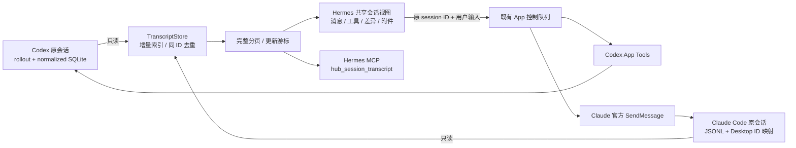
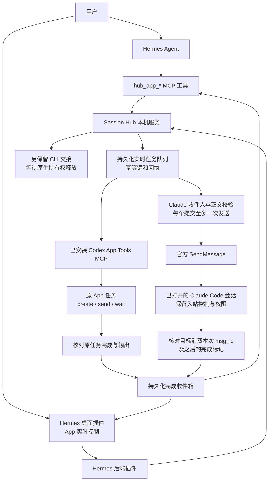

# Session Hub 0.4.4：原会话共享视图与 App 控制

> GitHub 源码版：先阅读 [拉取、配置与安装说明](CHECKOUT.zh-CN.md)。下面的历史验收记录属于原 Windows 环境；证据文件和真实会话数据未公开。旧外层路径命令由 CHECKOUT 中的仓库根目录命令替代。

新增：[统一 Session 任务看板与实时对话引用](TASK-BOARD.zh-CN.md)。支持 Hermes / Codex / Claude 卡片、筛选 / 排序 / 分组 / 字段设置，以及 Agent 创建任务和引用。

Codex 和 Claude Desktop Code 看板任务现在可在 Hermes 详情页直接续聊原任务，采用居中消息区和底部输入框，保留草稿并对回执丢失进行幂等核对。默认留在 Hermes，单独按钮打开 Codex。支持粘贴、选图、拖放图片、缩略图和大图预览，以及消息复制、执行过程折叠。本地文档链接可点击预览，每轮回复下方展示完整的修改文件汇总和可展开差异。图片通过本地文件工具交给原 Codex 任务读取（每条最多 5 张 PNG/JPEG/WebP，每张 8 MB），已完成真实识图验收；不是原生多模态附件参数。审批、停止和原生 Review 尚未接入，本轮不属于原生界面嵌入。底层架构、接口覆盖和真实验收记录见 [Codex 集成研究](../../docs/session-hub/CODEX-IN-HERMES.zh-CN.md)。

2026-09-18。本扩展通过独立插件读取 Codex / Claude Code 的原会话记录，提供完整本地历史分页、增量同步和向原 App 会话发送消息。本扩展代码不需要修改 Hermes 核心。原 CLI 交接仍保留，两种通道不会自动替换。

**这是原会话的另一个查看和发送入口，不是把摘要复制成一个新会话。也不是原 App 的完整 UI 镜像。** 可读取本机保留的消息、工具输入/输出、文件差异、上下文标记、跨会话指令和附件记录；无法恢复源头已截断/删除的数据，无法复制审批弹窗、未落盘流式片段、私有推理、云端未下载记录。Claude 普通 Chat / Cowork 不在范围内。

## Claude App 使用

在 **统一看板** 将快捷筛选设为 **全部任务**，会话范围设为 **包含近期历史**，搜索 Claude 任务并打开。底部输入框直接续聊原会话；若不在线，点 **在 Claude App 中打开**，待会话启动后发送。新建任务选择 Claude Code / 原生 App，点 **在 Claude App 准备草稿**，到 Claude 检查项目并发送后再刷新看板。

已完成文本原会话续聊及上下文连续性验收。Claude 图片上传、会话隔离和路径投递已通过契约测试，Claude 实际识图尚未验收。新建不会自动点击原生发送；审批、停止、Chat / Cowork 不在本版控制范围。详见 [Claude 接入与验收](CLAUDE-APP.zh-CN.md)。

## 共享会话体验

1. 在 Hermes 左侧打开 **会话协作 → 共享会话 · App 实时控制**。
2. 选择 Codex App 或 Claude Code，搜索标题或原 session ID，点击会话。
3. **原会话记录** 展示消息、Markdown 表格/代码与可展开的工具调用、执行结果和差异。每 3 秒增量读取；同 ID 的更新原位替换。向上点 **加载更早记录** 直到历史开头。
4. **导出全部记录** 会逐页生成 JSON 文件；导出的是本地可用的规范化记录。上下文默认折叠隐藏，可勾选显示；来源记录保留工具原始参数和结果。
5. 图片内嵌数据可直接显示；明确引用的本地 PNG/JPEG/GIF/WebP 可点击预览。文件须与该记录的原生图片路径精确匹配，最大 16 MB；网络图片、其他附件和 Markdown 文件链接不自动打开。
6. 下方输入框点 **发送到 App 原会话**，使用相同原生 ID。Claude Code 必须先在 App 打开对应会话，收到的是官方 peer 消息；权限审批仍由原 App 处理。

Hermes 模型也已获得 `hub_session_transcript(engine, session_id, cursor, limit)`：从最新页开始，按 `next_cursor` 读取更早记录直到 null。适配器不再截取每条正文；旧的 `hub_read_session` 仍是摘要接口。完整记录可访问，不代表无限长历史能同时放入模型上下文。



`data/transcripts.sqlite` 是可重建的本机派生索引，不修改外部数据库。JSONL 只推进已完整写入的行，未完成尾行等待后续同步；数据库变化和追加记录产生单调修订号。会话游标绑定引擎、ID 和索引代次，避免串页。索引包含本地会话正文，请与原生历史一样保护，不要提交 `data/`。

## 当前能力

| 能力 | Codex App | Claude Desktop Code |
|---|---|---|
| 已有 session 和当前工作 | App 接口读取，返回状态、最近 turn、回复；保留原生历史读取 | 原生历史、Desktop ID 映射、live peer 状态 |
| 新建 App 任务 | 内置 App Tools 创建，实测通过 | 尚未实现，先在 App 中打开会话 |
| 原会话续聊、运行中追加 | 已实测同一个 turn 处理追加指令 | 已接官方 SendMessage；后台目标收发通过，Desktop 专用目标待验收 |
| 完成回传 Hermes | App 完成状态与最终回复进入收件箱 | 精确匹配目标实际消费的 msg_id，再核对后续完成；后台目标实测通过 |

**Claude 官方 ListAgents 已确认能够发现 Desktop Code 会话，但后台会话测试不能等同于 Desktop GUI 验收。** 验证期间 Claude 窗口被用户操作/最小化，自动点击中止；没有给其他正在开发的用户会话发测试消息。已请求指定“Hermes 实时控制验收”会话，待提供后完成最后一步（名称使用正常的 Hermes 字母即可）。Claude Chat/Cowork 不在当前范围。

## 体验

安装副本已更新。插件前端支持热更新；首次安装后，旧后端需要重新加载插件路由。遇到 404/405，结束当前执行后重启 Hermes 后端或重新打开 App。不要把“重启消息网关”误认为“重启桌面后端”。

1. 双击外层 `Start-Hermes.cmd`，进入侧栏 **会话协作**。
2. 顶部 **App 实时控制**：选引擎，搜索会话，输入任务，点 **发送到 App 原会话**。运行中也可追加。
3. **新建 Codex App 任务** 默认创建无项目任务。针对保存的项目，可在 Hermes 对话中先查 `hub_app_projects`；Git 项目默认 worktree，明确要求时才直接使用保存的 checkout。
4. 查看实时任务队列与完成收件箱。Codex 新任务可能暂未进入 App 最近任务列表，Hub 会按返回的实际 ID 经 App `read_thread` 补充显示；选择后可点 **在 Codex App 中打开**。

Hermes 中可直接说：

> 用 hub_app_sessions 列出 Codex App 和 Claude Code 当前正在做什么，先不要发送任务。

> 通过 App 实时控制，在 Codex App 新建一个无项目任务，整理角色记忆模块接口方案。

> 向 Codex App 的 session <完整 ID> 追加要求：本轮加入输入输出样例。使用 hub_app_dispatch，保留原 App 会话。

> 向 Claude Code 已打开的“测试会话名”发送：只回复收到 Hermes 的实时任务，不修改文件。用 App 实时通道，随后查询完成结果。

实时通道保留目标 App 现有权限。Claude 收到的是 peer 消息，不能替代用户同意、修改权限配置或回答审批。目标需要审批或拒收时由目标 App 决定。下方 CLI 区域的只读/写入选项不影响 App 权限。

## 架构



### Codex 接入

`codex_app.py` 使用已安装的 `codex-app-tools/0.1.4/server.mjs` 和标准 MCP 客户端。绑定采用本次真实控制任务提供的 `CODEX_APP_TOOLS_PIPE_PATH` 与 `CODEX_THREAD_ID`，不伪造其他任务身份，不自行写入 App 的 app-server stdio。仅开放列举、读取、创建、发送、等待、打开任务；禁止向控制任务自身发送，避免循环。

这是已安装 App Tools 的接口，**不是官方 App Server 文档承诺的通用外部控制 API**。官方 [App Server 文档](https://developers.openai.com/codex/app-server) 说明线程、turn 与 steering；本版实际接入使用内置 App Tools，升级后需要兼容性检查。

绑定保存在 `data/codex-app-binding.json`，仅留本机。App 关闭时接口不可用。重启导致绑定失效时，在 Codex App 控制任务中运行以下命令重新绑定；普通资源管理器打开的终端没有所需的 App 环境：

```powershell
& E:/2_GithubSpace/HermesAgent/hermes-agent/.venv/Scripts/python.exe E:/2_GithubSpace/HermesAgent/hermes-agent/extensions/session-hub/codex_app.py bind
```

项目创建若返回 `clientThreadId`、仍在准备 worktree，本版保留回执并标为 needs_attention，不会把它冒充可用 threadId。

### Claude 接入

`claude_live.py` 读取 `.claude/sessions/*.json` 的公开注册字段，验证 PID 与 Windows 进程创建时间，不读取或输出 peer 密钥。普通 `claude agents --json` 本机未列出 Desktop peer，实际官方 ListAgents 已确认能够发现。

隔离的 CLI relay 只开放 SendMessage。临时 PreToolUse hook 精确校验规范字段 `to`、`message`，核对唯一名称和原生 ID，并用原子 claim 阻止重复发送。符合条件时不覆盖原生权限判断，其他目标或改写正文会被阻止；不修改全局 Claude 设置。

官方 [跨会话消息文档](https://code.claude.com/docs/en/cross-session-messaging) 说明消息在工具调用之间进入活跃会话，空闲会话可开始新一轮，并保留接收方入站控制。本版让官方工具完成认证与投递，没有直接连接受认证的 peer 管道。

## 状态和可靠性

| 状态 | 含义 |
|---|---|
| queued / sending | 存入 Hub / 正在调用 App |
| delivered | 接口接受或 Claude 返回消息 ID，尚不代表目标完成 |
| running | Codex App 返回正在执行；或 Claude 原记录已消费本次 msg_id |
| completed | 原任务已完成；Claude 还需在目标日志确认本次 msg_id 被消费 |
| needs_attention | 权限、投递、初始化或监控超时需要查看 |
| delivery_uncertain | 发送中断线或重启，可能已发出；不会自动重发 |

相同 request_key 仅接受同一任务参数。Claude 完成关联不会把旧回复或尚未接收的消息算作成功。监控超时不终止 App 原任务。读取收件箱不会清除其他客户端事件，完成通知不会自动触发 Hermes 新一轮模型推理。

所有绑定、任务内容和 relay 日志在被忽略的 `data/`；服务仅监听本机并要求 Bearer token。原生数据库只读，只有官方 App/引擎自己记录会话变更。

## 验证

证据：`live-acceptance-results.json`、`ui-test-results.json`、`ui-preview.png`。

- Codex App 任务：`01a0b3a9-1834-7140-8393-0f167c52b8f1`，**Hermes App 实时控制验收**。
- turn `01a0b3ab-5932-7bc0-94fa-393e389f7150` 处于 inProgress 时追加指令，同 turn 最终返回 `HERMES-APP-LIVE-918 LIVE-STEER-OK`。
- 经 Hub 服务再次发送到该 App 任务，返回 `HERMES-APP-LIVE-918 LIVE-STEER-OK HUB-SERVICE-OK`，完成事件已入收件箱。
- Claude Desktop Code 原任务已完成真实续聊验收：`Hermes-Live-Protocol-Test`，原 Session ID `2a180f82-79ef-4d06-907d-1f00b3b86a31`。Hub 与 Hermes 输入框各发送一次，Claude 复述旧上下文并追加验收标记；原生 App、Hermes 共享时间线及完成收件箱均已确认。证据见 `claude-desktop-acceptance.json`、`claude-conversation-live-results.json`。
- 21 项测试通过：原 13 项交接/投递契约，以及 8 项完整历史测试（250 条长消息、多页无丢失、半行续写、原位更新、游标隔离、原生来源合并、完整工具输出、图片路径与格式约束）。
- 真实 Codex 与 Claude Code 会话分别读取 3.3 MB / 8.1 MB 的本地记录，解析失败数为 0。不同会话的源记录数与展示项数不同：系统元数据被计数但不当作聊天，重复的原生同 ID 记录合并。
- 真实服务驱动的浏览器组件测试通过；另用 85 条合成记录验证翻页、原位同步、Markdown、完整工具输出、内嵌图片、全部导出以及 HTML 不执行。合成测试不代替 App 投递验收。
- 实际 Hermes 桌面经热更新及空闲后端重载，已在共享会话页面确认 Codex 验收原 ID、20/20 展示记录、51 条源记录、跨会话指令与最终回复；未关闭窗口或提交用户草稿。原 App 界面视觉一比一复刻不在验收结论中。
- Hermes 模型实际调用 `hub_app_read`、`hub_app_jobs` 成功，确认读到 App 最新回复和两条 completed 结果。日志：外层 `runtime/logs/session-hub-app-mcp.stdout.log`。

## 维护

主要文件：`transcript.py` 读取并索引完整本地时间线，`live.py` 管理实时任务，`codex_app.py` / `claude_live.py` 是两套适配器，`claude_guard.py` 校验消息，`plugin/` 是 Hermes 插件，`mcp_server.py` 提供 Agent 工具。

```powershell
# 从 Git 仓库根目录执行（先按 CHECKOUT 配置 settings.json）
& .\.venv\Scripts\python.exe extensions/session-hub/install.py --hermes-home C:/Temp/hermes-session-hub-test
& .\.venv\Scripts\python.exe extensions/session-hub/client.py health
bash scripts/run_tests.sh extensions/session-hub
& .\.venv\Scripts\python.exe extensions/session-hub/verify_gateway.py
& .\.venv\Scripts\python.exe extensions/session-hub/verify_transcript.py
node extensions/session-hub/ui-test.mjs
```

关闭 Hermes 不会停止已派发的 App 工作。停止 Hub 前确认没有 CLI running/checking 和实时 sending 任务；异常时先检查原 App，再决定是否新建请求。原 CLI 写文件验收在 `acceptance-results.json`；原版说明和卸载步骤见 [0.1 历史记录](HISTORY-v0.1.zh-CN.md)。
